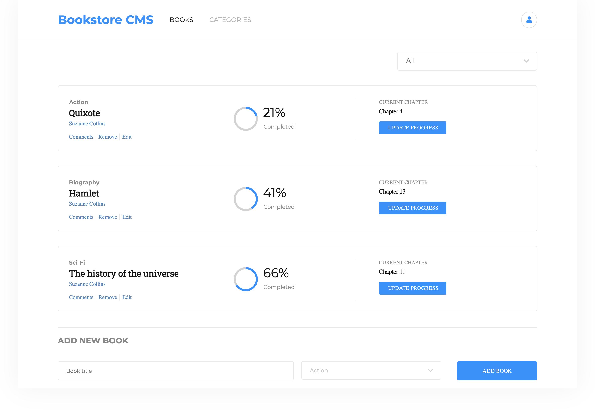

# Magic Bookstore

### Extra feature

> We have created a dynamic svg (Progress component) for showing the progress of book completion. Currently the svg is accepting random percentage which is generated by `Math.random()` method.

## Table of Contents

- [About the Project](#about-the-project)
- [Built With](#built-with)
- [Live Demo](#live-demo)
- [Getting Started](#getting-started)
- [Authors](#authors)
- [Contributing](#contributing)
- [Show your support](#show-your-support)
- [License](#license)
- [Acknowledgements](#acknowledgements)

## About the Project

Bookstore built using [React](https://reactjs.org/) and [Redux](https://redux.js.org/).

Project specifications made by [Microverse](https://www.microverse.org/).

Magic-books Inc. is a company based in Germany. They want a front-end of an application that will help them organize and manage their bookstore. It has to be fast, dynamic and responsive to their actions.

In the application you are able to add new books of different categories and filter the displayed books by category.

## Built With

- [JavaScript](https://en.wikipedia.org/wiki/JavaScript)
- [React](https://reactjs.org/)
- [Redux](https://redux.js.org/)
- [Node package manager](https://www.npmjs.com/)
- [HTML5](https://en.wikipedia.org/wiki/HTML5)
- [CSS](https://www.w3schools.com/Css/)

## Live Demo

[Live Demo Link](https://magic-bookstore111.herokuapp.com/)

## Getting Started

To get a local copy up and running follow these simple example steps.

1. On the project GitHub page, navigate to the main page of the repository.
2. Under the repository name, locate and click on a green button named `Code`.
3. Copy the project URL as displayed.
4. If you're running the Windows Operating System, open your command prompt. On Linux, Open your terminal.
5. Change the current working directory to the location where you want the cloned directory to be made. Leave as it is if the current location is where you want the project to be.
6. Type git clone, and then paste the URL you copied in Step 3.  
   e.g. $ `git clone https://github.com/Amita-Roy/Magic-Bookstore.git`
7. Press Enter. Your local copy will be created.
8. On your console, move to the place where this folder is cloned
9. Run `npm start`, then server is automatically opened

## Authors

👤 **Amita Roy**

- Github: [@Amita Roy](https://github.com/Amita-Roy)
- Twitter: [@Amita Roy](https://twitter.com/AmitaRoy14)
- Linkedin: [@Amita Roy](https://www.linkedin.com/in/amita-roy-3b823b68/)

👤 **Angel Barros**

- GitHub: [@Zappat0n](https://github.com/Zappat0n)
- LinkedIn: [LinkedIn](https://www.linkedin.com/in/angel-barros/)

## Contributing

Contributions, issues, and feature requests are welcome!
Feel free to check the [issues page](../../issues).

1. Fork the Project
2. Create your Feature Branch (`git checkout -b feature/AmazingFeature`)
3. Commit your Changes (`git commit -m 'Add some AmazingFeature'`)
4. Push to the Branch (`git push origin feature/AmazingFeature`)
5. Open a Pull Request

## Show your support

Give a ⭐️ if you like this project!

## License

This project is [MIT](./LICENSE) licensed.

## Acknowledgements

- [React](https://reactjs.org/)
- [Redux](https://redux.js.org/)
